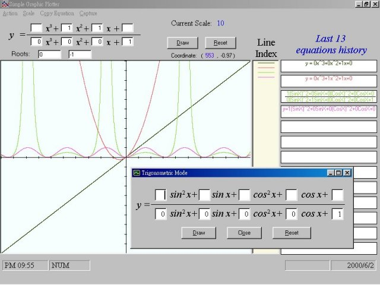



## Mathematical Graphic Plotter

### Description

You can draw difficult mathematical graphs painlessly with this program. For example,

you can draw (x^3+2x+3)/(2x^2+x+1) easily with this program.
 
### More Info
 
Just input the coefficients of the equation.

The program will returns the correspondent graph.

             |
---                |---
**Submitted On**   |2000-06-02 22:32:22
**By**             |[Jason](https://github.com/Planet-Source-Code/PSCIndex/blob/master/ByAuthor/jason.md)
**Level**          |Beginner
**User Rating**    |4.3 (30 globes from 7 users)
**Compatibility**  |VB 5\.0, VB 6\.0
**Category**       |[Math/ Dates](https://github.com/Planet-Source-Code/PSCIndex/blob/master/ByCategory/math-dates__1-37.md)
**World**          |[Visual Basic](https://github.com/Planet-Source-Code/PSCIndex/blob/master/ByWorld/visual-basic.md)
**Archive File**   |[CODE\_UPLOAD6385632000\.zip](https://github.com/Planet-Source-Code/jason-mathematical-graphic-plotter__1-8597/archive/master.zip)

